# Devops Commands Guide

---

## Linux Intro and Commands


### Deployable package management

  

- packages

- application code or executable

- dependencies (libraries or other packages)

- types

  

- red hat

  

- rpm format (red hat package manager)

- package manager

- rpm: offline package manager

- yum or dnf: online package manager

  

```bash
# update the yum sources
> sudo yum update

# install apache2
> sudo yum install httpd
```

  

- debian

  

- deb format

- package manager

- dpkg: offline package manager

- apt or apt-get or snap: online package manager

  

```bash
# update the apt sources
> sudo apt-get update

# install required application
> sudo apt-get install htop apache2

# purge or remove the package
> sudo apt-get purge apache2  
```

  

# service management

  

- service

- application which runs in the background

- does not have any GUI

- uses daemons to provide the functionality

- controled by systemd (system daemon)

- systemd is the first process which starts after the computer boots

  

```bash
# syntax
# > sudo systemctl <operation> <daemon or service>
# get the status of the service
> sudo systemctl status apache2

# start the service
> sudo systemctl start apache2 

# restart the service
> sudo systemctl restart apache2

# stop the service
> sudo systemctl stop apache2

  
# start the service at the time of system boot
> sudo systemctl enable apache2

  
# disable the service from running at the system boot
> sudo systemctl disable apache2

# check if the apache2 is working
> curl http://locahost

> curl http://127.0.0.1

```
```bash
# add http service in firewall
> sudo firewall-cmd --add-service http --permanent

# reload the firewall settings
> sudo firewall-cmd --reload

# get the list of allowed services
> sudo firewall-cmd --list-services

```

  

# vim: text editor

  

```bash 

# install vim

> sudo apt-get install vim

> sudo yum install vim

> sudo dnf install vim

```

  

- mode

- view mode

- read only mode

- default mode

- escape yy - yank (copy) the current line

- escape 2y - yank two lines

- escape dd - delete the current line (cut the line -> keep the contents in memory)

- escape 2dd - delete two lines (current and the next one)

- escape p - paste the yanked (copied) line(s)

- escape u - undo the last step

- control + r - redo the step

- escape o - insert a new line below

- escape G - goto the last line of the document

- escape gg - goto the first line of the document

- escape { - goto the previous page

- escape } - goto the next page

- escape :set number - show the line numbers

- escape / - search a text in the current document

- escape n - search forward

- escape N - search backward

- escape w - move to next word

- escape b - move to the previous word

- escape $ - goto the last character of the current line

- escape ^ - goto the first character of the current line

- insert mode

- used to write the contents in the file

- escape + i - to start the insert mode

- escape :w - write the contents to the disk (save)

- escape :q - quit from the editor

- escape :wq - save the contents and quit

- escape :q! - forcelly quit without saving the contents

- visual mode

- escape v: start the visual mode

- select the portion to copy using left and right arrows and press y

- escape p - paste the yanked contents

- to open multiple files

- vim -O <file1>  <file2>: open the files vertically

- vim -o <file1>  <file2>: open the files horizontally

- control ww: used to switch between the files

- to configure vim with global settings

- save the settings in ~/.vimrc file

- ~: home directory of currently logged in use

- file/directory which starts with . is a hidden file/directory

- set number -> enable line numbers

- set tabstop -> set the tab size

- set expandtab -> convert the tab to space

  

# bash scriptings

  

- script which contains the list of commands which can be executed by bash


  

# common commands

  

- hostnamectl: get information about the host

- curl: console url (browsing website on console)

- ifconfig: to get the ip related information

- ip: used to get the ip related information

- ip address show

- firewall-cmd: used to deal with firewall settings

---
<div style="page-break-after: always;"></div>

# Git

  

## Installation

  

```bash
# update the apt repo

> sudo apt-get update


# install git

> sudo apt-get install git

# on windows

# https://git-scm.com/downloads/win
```

  

## First time configuration

  

```bash
# set the user name

> git config --global user.name "Amit"
  

# set the email for the user

> git config --global user.email "pythoncpp@gmail.com"

```

  

## Basic workflow

  

```bash
# initialize a repository

> git init


# get the status of working directory

> git status


# get the status of working directory in one line (short status)

> git status -s


# statuses

# first letter: status of a file with respect to the staging area

# second letter: status of a file with respect to the working directory

# ??: the file is not yet committed in the repository

# A : the file is present in the staging area and will be added to the repository when committed

# M: the file is modified and is present in the working directory

# M : the file is modified and is added to the staging area

# UU: the file has got at least one conflict


# conflict

# the file is modified by both the branches on the same line

# in which scenario, git can not handle merging the changes


# add the changes to the staging area

# git add <file(s) with changes>

# git add . : add all the files which are changed in the current directory

# > git ady myfile

> git add .
  

# commit the changes

# > git commit -m <message>

> git commit -m "first commit"

  

# get the logs

> git log

# get the logs

# --oneline: shows only one line log info

# --graph: render the commit graph

# --color: enable color while rendering the commit graph

> git log --oneline --graph --color

  

# get the difference between the current and previous version of all updated files

# +: the line is added to the file

# -: the file is deleted from the file

> git diff


# get the difference between the current and previous version of selected file

# > git diff <file name>

> git diff myfile


# replace the last version with current version

# > git checkout <filename>

> git checkout myfile

# remove all the changes from staging area and move them to the working directory

# this command will not remove the changes, but only move from staging to working directory

> git reset

# hard reset

# - all the changes (from working directory and staging area) will be removed

# - once removed there is no way to get them back

# note: please execute this command on your own risk

> git reset --hard

```

  

## Git internals

  

- git init command creates a repository (directory named .git)

- .git directory contains

- HEAD

- file which has an entry of current branch

- branches

- config

- file contains the local repository configuration

- the configuration here is restricted only for the current repository

- description

- description about the repository

- hooks

- contains the scripts to be executed on different events

- the scripts can be written in any language or even shell scripts

- info

- objects

- object file stores the encrypted metadata (file contents or commit info etc)

- every object (file) has a unique identifier (40 bytes)

- out of 40 bytes

- first 2 bytes are used to create a directory

- remaining 38 bytes are used to create a file to store the contents of a file

- git used SHA algorithm to get the hash of the object

- types

- blob

- object file which stores the contents of a file in encrypted format

- gets created per file

- tree

- object file which contains the mappings of blob object files with their respective file names

- object gets create per directory

- commit

- object file which stores the commit information

- contains

- author details

- committer details

- unix timestamp

- commit message

- parent object id

- root commit object

- this type of commit object will get created only once (first time)

- this commit object does not contain the parent object id

- refs

### GIT INTERNALS WORKING

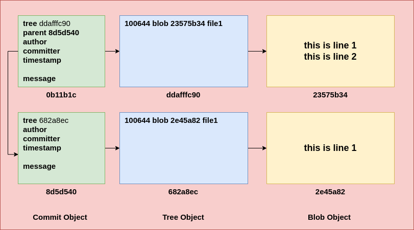  

```bash

# find the type of the object

# -t: type of an object

# > git cat-file -t <object id>

# get the readable contents of an object

# -p: pretty print the contents

# > git cat-file -p <object id>

# delete all unwanted objects and create pack files
# gc: garbage collection
> git gc

# watch the progress

> cd .git
> rm hooks/*
> watch -n 1 tree .
```

  

## Branches

  

- is simply reference to a latest commit object

  

```bash
# get the list of branches
> git branch

# create a new branch
# the new branch will have same commit id as that of the current branch

# > git branch <branch name>
> git branch branch1
  
# switch to other branch
# > git checkout <branch name>
> git checkout branch1
  

# create a new branch and checkout immediately
# > git checkout -b <branch name>
> git checkout -b branch2

# merge the changes from one branch to another branch
# note: first checkout the branch in which you want to merge another branch
> git checkout master

# > git merge <branch name>
> git merge branch1

# squash merge
# - collect all the commit objects of second branch and turn them into a single object

# - then the single commit object gets merged in the source branch
# - this will help git to reduce the commit history/tree/graph
  

# delete a branch
# > git branch -d <branch name>
> git branch -d branch1

# rename a branch
# the current branch will be renamed
# > git branch -M <new branch>
> git branch -M main
```

  

## Stash

  

```bash
# get the list of changes parked in the stash area
> git stash list

# stash the changes
# move the changes from working directory to stash area
# > git stash
# > git stash save <message>
> git stash save "algo1"

# get the details of a stash entry
# > git stash show <stash id>
> git stash show stash@{0}

# apply the changes from stash area to working directory
# > git stash apply <stash id>
> git stash apply stash@{1}

# delete the stash object
# > git stash drop <stash id>
> git stash drop stash@{0}

# apply and drop the last commit from the stash area
# git stash pop = git stash apply + git stash drop
> git stash pop
``` 

## git remote

```bash
# get the remote repo details
> git remote -v

# connect the local repo to the remote one
# > git remote add <alias> <remote repo url>

# remove the remote from repository
# > git remote remove <alias>
> git remote remove origin

# get the repository contents for the first time
# > git clone <git repository url>
> git clone https://github.com/pythoncpp/application1.git

# generate ssh keys (private and public)
# public key: used for encryption
# private key: used for decryption
# this command will create keys under ~/.ssh directory
> ssh-keygen
```

---
<div style="page-break-after: always;"></div>

# AWS EC2 : Install apache

```bash
# connect to the ec2 instance

# usernames

# - ubuntu: ubuntu server AMI
# - ec2-user: Amazon Linux (Centos based image)
# - Administrator: Windows
# > ssh -i <pem file path> <username>@<public ip of ec2 instance>


# update the apt cache
> sudo apt-get update


# install apache
> sudo apt-get install apache2


# check the status of the apache2 service
> sudo systemctl status apache2


# start the apache service
> sudo systemctl start apache2

# enable the service to run after reboot automatically
> sudo systemctl enable apache2


# upload the file(s) from your machine to the ec2 instance
# > scp -i <pem file path> <source file> <user>@<public ip address>:<destination path>
> scp -i ~/Downloads/key-demops.pem index.html ubuntu@18.206.171.237:/tmp/

# copy the file to the apache's web root directory

> sudo mv /tmp/index.html /var/www/html/
```

### AWS VPC ARCHITECTURE

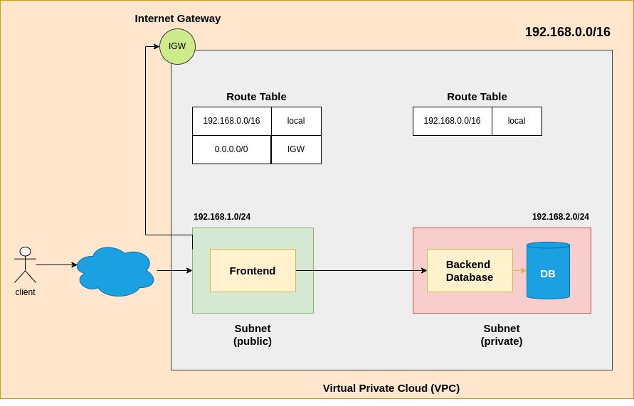

---

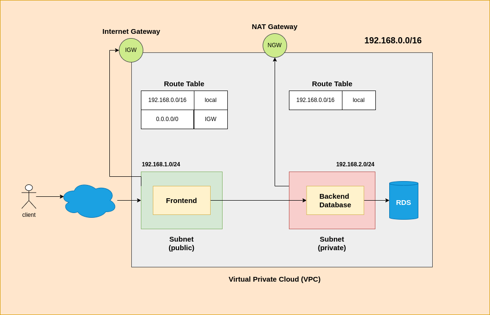

---

### AWS VPC PEERING

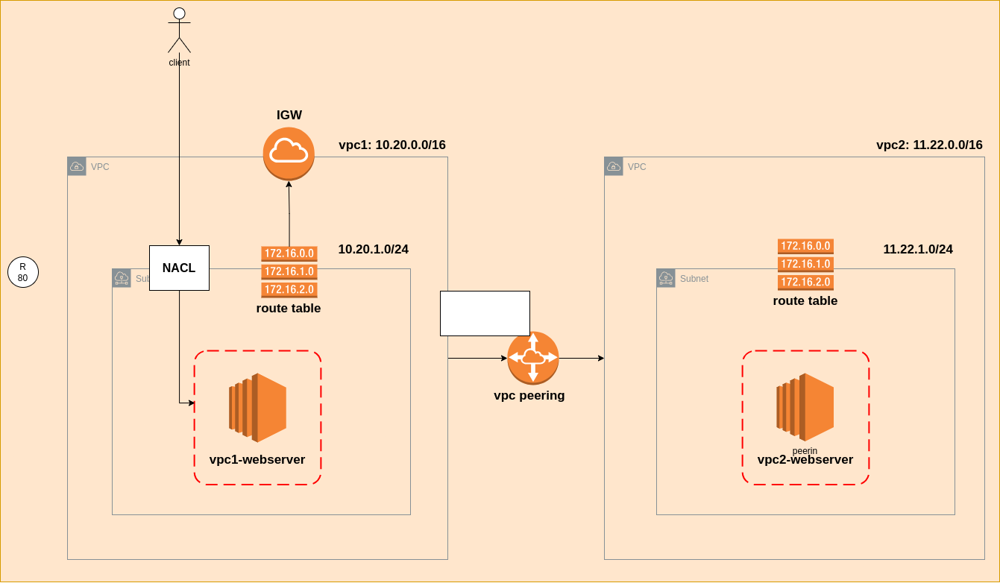

---

### AWS ELASTIC LOAD BALANCER

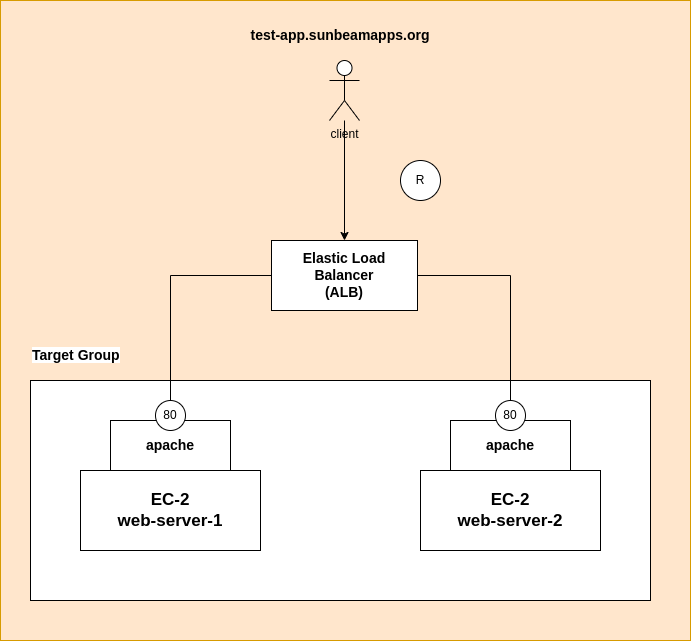

---

### AWS S3
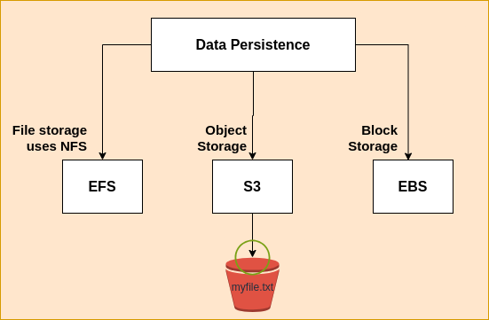

---

### JUMPBOX ARCHITECTURE

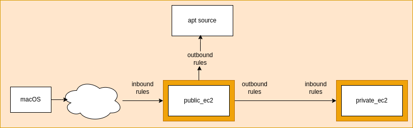

---
<div style="page-break-after: always;"></div>


# Terraform

  

## Installation on Ubuntu

  

```bash
# download the key to access hashicorp apt source

> wget -O - https://apt.releases.hashicorp.com/gpg |  sudo  gpg  --dearmor  -o  /usr/share/keyrings/hashicorp-archive-keyring.gpg


# add the hashicorp apt source
> echo "deb [arch=$(dpkg  --print-architecture) signed-by=/usr/share/keyrings/hashicorp-archive-keyring.gpg] https://apt.releases.hashicorp.com $(lsb_release  -cs) main"  |  sudo  tee  /etc/apt/sources.list.d/hashicorp.list

# update the apt cache
> sudo apt update

# install terraform
> sudo apt install terraform

# check if terraform is installed
> terraform version
```

  

## installation on macOS

  

```bash
# add brew source
> brew tap hashicorp/tap

# install terraform
> brew install hashicorp/tap/terraform
```

  

## Configure AWS CLI

  

```bash
# open the bashrc file
> vim ~/.bashrc

# add the following configuration
>  export  AWS_ACCESS_KEY_ID=
>  export  AWS_SECRET_ACCESS_KEY=
>  export  AWS_DEFAULT_REGION=

# North Virginia - us-east-1
# Mumbai - ap-south-1

# load the settings in the same terminal
> source ~/.bashrc

# confirm if the access key is properly configured
> echo $AWS_ACCESS_KEY_ID
> echo $AWS_SECRET_ACCESS_KEY
```

  

## Configure the VS

```bash
https://marketplace.visualstudio.com/items?itemName=HashiCorp.terraform
```

  

## Test the settings

  

```terraform
terraform {

	required_version = ">= 1.0.0"

	required_providers {

		aws={

			source = "hashicorp/aws"

			version = "5.82.2"

		}

	}

}

  

provider "aws" {

	region = "us-east-1"

}

  

resource "aws_instance" "web-server" {

	ami = "ami-0e2c8caa4b6378d8c"

	instance_type = "t2.micro"

	key_name = "key-demops"

	tags = {

	Name = "Web Server"

	}

}

```

  

## perform the operations

  

```bash
# download required providers
> terraform init

# check if the configuration is valid
> terraform validate

# get the plan of execution
> terraform plan


# create the infra using terraform

> terraform apply

# refresh the state of resources

> terraform refresh
```
---
<div style="page-break-after: always;"></div>

# Ansible

  

## vagrant setup

  

```bash
# configure vagrant machine
> vagrant init <box name>

# create the machine
> vagrant up

# check the status
> vagrant status

# get the global status
> vagrant global-status

# shut down the machine
> vagrant halt
```

  

```ruby
Vagrant.configure("2") do |config|
	config.vm.box  =  "ubuntu"
	config.vm.provider  "vmware_desktop"  do |v|
	v.linked_clone  =  false
end

# define the controller node
	config.vm.define  "controller"  do |controller|
		# change the hostname
		controller.vm.hostname  =  "controller"
	end	

# define the manged node
	config.vm.define  "m1"  do |m1|
		# change the hostname
		m1.vm.hostname  =  "node"
	end
end
```

  

## installing ansible

  

- note: please make sure that you are inside the controller node

> vagrant ssh controller
```bash
# update the apt cache
> sudo apt-get update

# install the pre-requisites
> sudo apt install software-properties-common

# add the ansible apt source
> sudo add-apt-repository --yes --update ppa:ansible/ansible


# install ansible
> sudo apt install ansible

# check if ansible is installed
> ansible --version
```

  


## configure the managed node

  

- note: make sure that you are connected to the managed node
```bash
> vagrant ssh m1

# change the hostname to controller
> sudo vim /etc/hostname

# restart the machine
> sudo reboot
```


  

## configure the vim

  

```bash
# configure the vim using ~/.vimrc
> vim ~/.vimrc

# convert the tab into spaces
set  expandtab

# one tab will be converted to two spaces
set  tabstop=2

# enable the line numbers
set  number
```

  

## create the inventory

  

```bash
# create a directory to hold the inventory
> mkdir myplaybooks

# create an inventory file for listing all the nodes
> vim inventory.ini

# [hosts] <- group name
# 172.16.140.145 <- managed node ip address
# 172.16.140.145 ansible_ssh_user=vagrant ansible_ssh_pass=vagrant <- managed node ip address

# check the connectivity with the nodes
# hosts: group name
# ping: module (command which will check the connectivity)
# inventory.ini: inventory file
> ansible hosts -m ping -i inventory.ini
```

  

## playbooks

  

```bash
# execute a playbook
> ansible-playbook playbook.yaml -i inventory.ini
```

---
<div style="page-break-after: always;"></div>

# Docker

  

## installation

  

```bash
# update the apt cache

> sudo apt-get update

# install pre-requisites
> sudo apt-get install ca-certificates curl
  
# create keyrings
> sudo install -m 0755 -d /etc/apt/keyrings

# download the gpg key for downloading the docker tool
> sudo curl -fsSL https://download.docker.com/linux/ubuntu/gpg -o /etc/apt/keyrings/docker.asc
> sudo chmod a+r /etc/apt/keyrings/docker.asc

# Add the repository to Apt sources:

> echo \

"deb [arch=$(dpkg --print-architecture) signed-by=/etc/apt/keyrings/docker.asc] https://download.docker.com/linux/ubuntu \

$(.  /etc/os-release  &&  echo  "$VERSION_CODENAME") stable"  |  \

sudo  tee  /etc/apt/sources.list.d/docker.list  >  /dev/null


# update the apt cache
> sudo apt-get update


# install docker
> sudo apt-get install docker-ce docker-ce-cli containerd.io docker-buildx-plugin docker-compose-plugin


# check if the docker service is installed
> sudo systemctl status docker


# start the docker server
> sudo systemctl start docker

# enable the docker server
> sudo systemctl enable docker

# add the current user to the docker group
> sudo usermod -aG docker $USER

# restart the machine
# check if docker is installed
> docker version
```

  

## image commands

  

```bash
# get the list of images available on the machine
> docker image ls

# download or pull the image on the machine
# > docker image pull <image name>
# the image gets stored in /var/lib/docker/images directory
> docker image pull hello-world


# remove image from machine
# > docker image rm <image name>
> docker image rm hello-world

# get information about an image
> docker image inspect hello-world
```

  

## container commands

  

```bash
# get the list of running containers
> docker container ls


# get the list of containers in all states (created, updated)
> docker container ls -a

# create a container
> docker container create hello-world

# get the details of selected container
# > docker container inspect <container name or container id>
> docker container inspect c1c


# start already created container
> docker container start <container id or name>


# stop a running container
> docker container stop <container id or name>

# remove a stopped container
> docker container rm <container id or name>


# remove a running container
> docker container rm --force <container id or name>
```

  

```bash
# run the container
# create and start the container

# this command will run a new container every time
> docker container run <image name or id>

# set the name while running the application
# this container will run by default in attached mode
> docker container run --name <name>  <image name or id>

```
---
### Attached Mode Architecture
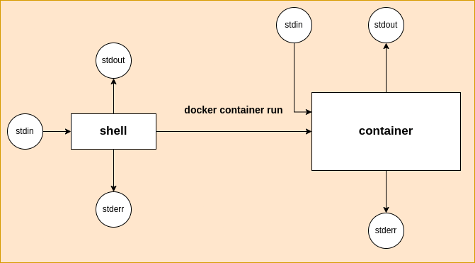

```bash
# run the container in detached mode (background)
# -d: detached mode
# -i: enable the docker interactive mode
# -t: enable the teletype terminal for the docker
> docker container run --name <name> -itd <image name or id>

# enable port forwarding for a container
# source port
# - port allocated on OS
# - can be any available port
# container port
# - port exposed by the container
# > docker container run --name <name> -itd -p <source port>:<container port> <image name or id>
> docker container run --name myhttpd -itd -p 8080:80 httpd
```
---
### Port forwarding Architecture

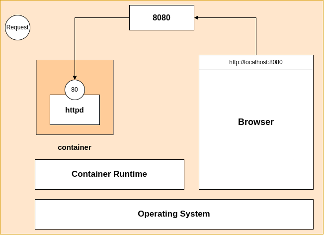

```bash
# run mysql in a container
> docker container run --name mysql -itd -p 3306:3306 -e MYSQL_ROOT_PASSWORD=root  mysql

# execute a command inside the container
# > docker container exec <container name or id> <command>
> docker container exec myhttpd date

# get the terminal from the container
# > docker container exec -it <container name or id> <shell>
> docker container exec -it myhttpd bash

# get the logs generated by the container
# > docker container logs <container name or id>
> docker container logs mysql
```

  

## volume

  

```bash
# get the list of volumes
> docker volume ls

# remove the unused volumes
> docker volume prune

# create a volume
# - this will create a new directory name myvolume under /var/lib/docker/volumes
> docker volume create myvolume

# find more information about a volume
> docker volume inspect <volume name>

# remove a volume
> docker volume rm <volume name>


# attach volume to a container
# > docker container run --name <name> -itd -p <source port>:<container port> -v <volume name>:<mount point inside the container> <image name>
> docker container run --name mysql -itd -p 3306:3306 -v myvolume:/var/lib/mysql -e MYSQL_ROOT_PASSWORD=root  mysql
```

### Volume Architecture

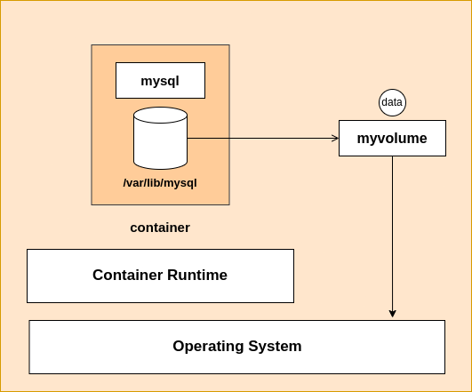
  

## images

  

- customize the docker image to run your application by using Dockerfile

- Dockerfile contains instructions/commands to create an image

- commands

- FROM

- used to select the base image

- COPY

- used to copy file/directory from local machine to the image

- syntax: COPY <local path>  <image path>

- e.g. COPY index.html /usr/local/apache2/htdocs/ will copy the index.html from local machine to the /usr/local/apache2/htdocs/ of image

- WORKDIR

- used to set the working directory

- if the directory does not exist, the image creates this new directory

- RUN

- used to run a command while building an image

- installing dependencies while building an image

- CMD

- used to run the command when container starts

- this must be the last command of your Dockerfile

- EXPOSE

- used to expose a port for consumer to access the application running inside the container

  

```bash

# build a custom image
# > docker image build -t <image name>:<image tag> <context>
> docker image build -t myimage .

# login with docker credentials
> docker login -u <user name>

# create a new tag for your image to push to the docker hub
# > docker image tag <existing image> <docker username>/<image name>
> docker image tag myserver amitksunbeam/myserver

# push the image to the docker hub
# > docker image push <image name>
> docker image push amitksunbeam/myserver

# to build the image for other CPU architecture use buildx command
> docker buildx build --platform <platform>  .
```

  

## swarm

  

```bash
# check if the node is a part of any swarm
> docker system info |  grep  Swarm

# start initializing the swarm
> docker swarm init

# remove the current node from the cluster
> docker swarm leave --force

# generate a token to add a worker
> docker swarm join-token worker
```

  

## node

  

```bash
# get the list of nodes
> docker node ls

# get the details of selected node
> docker node inspect <node id>

# remove a node from cluster
> docker node rm <node id>

# promote a worker to work as manager
> docker node promote <worker node id>


# demote a manager to work as worker
> docker node demote <manager node id>
```

  

## service

  

```bash
# get the list of services
> docker service ls

# create a service

# > docker service create --name <service name> <image name>
> docker service create --name myservice httpd

# create a service with required desired count
# > docker service create --replicas <desired count> --name myservice httpd
> docker service create --replicas 5 --name httpd -p 8080:80 httpd

# get the list of containers created by the service
> docker service ps <service name>

# remove a service
> docker service rm <service name>

# to watch the current state of service
> watch -n 1 docker container ls

# horizontally scale the service
# > docker service scale <service name>=<new desired count>
> docker service scale myservice=10
```

  

## docker compose

  

- used in development to deal with multiple microservices at a time

- in-built in the docker engine

- can be done using yaml configuration

- does not support Swarm

  

```bash
# get the list of services managed by docker compose
> docker compose ls

# create images for all the services mentioned in the docker-compose file
> docker compose build

# create containers for all the services
> docker compose up -d

# delete all the containers for the services
> docker compose down

# delete all the images along with the containers for the services
> docker compose down --rmi all
```

  

## docker stack

  

- used to deal with multiple service with swarm

```bash
# get the list of stacks
> docker stack ls

# deploy or create a new stack
# > docker stack deploy --compose-file <stack yaml file> --detached=true <stack name>
> docker stack deploy --compose-file docker-stack.yaml --detached=true  myapp

# remove a running stack
# > docker stack rm <stack name>
> docker stack rm myapp
```

---
<div style="page-break-after: always;"></div>

# minikube

  

## download and configure docker

  

```bash
# install pre-requisites

> sudo apt-get update

> sudo apt-get install ca-certificates curl

> sudo install -m 0755 -d /etc/apt/keyrings

> sudo curl -fsSL https://download.docker.com/linux/ubuntu/gpg -o /etc/apt/keyrings/docker.asc

> sudo chmod a+r /etc/apt/keyrings/docker.asc


# Add the repository to Apt sources:

> echo \

"deb [arch=$(dpkg --print-architecture) signed-by=/etc/apt/keyrings/docker.asc] https://download.docker.com/linux/ubuntu \

$(.  /etc/os-release  &&  echo  "${UBUNTU_CODENAME:-$VERSION_CODENAME}") stable"  |  \

sudo  tee  /etc/apt/sources.list.d/docker.list  >  /dev/null
> sudo apt-get update

# install docker
> sudo apt-get install docker-ce docker-ce-cli containerd.io docker-buildx-plugin docker-compose-plugin

# add current user to the docker group
> sudo usermod -aG docker $USER
# restart or logout
```

  

## download minikube

```bash
# download
> curl -LO https://github.com/kubernetes/minikube/releases/latest/download/minikube-linux-arm64

# install minikube on arm-64
> sudo install minikube-linux-arm64 /usr/local/bin/minikube && rm  minikube-linux-arm64
```

  

## minikube commands
```bash
# start the cluster
> minikube start

# stop the cluster
> minikube stop

# delete the cluster
> minikube delete

# get the cluster status
> minikube status

# add the following entry in your ~/.bashrc
> alias  kubectl="minikube kubectl --"
> source ~/.bashrc

# ssh into the minikube virtual machine
> minikube ssh

# get the dashboard
> minikube dashboard

# get the ip address of the minikube node
> minikube ip
```
---
<div style="page-break-after: always;"></div>

# Kubernetes

## Installation

> These commands to be fired on Master as well as all Nodes

```bash
set -euxo pipefail

# declare variables
KUBERNETES_VERSION="v1.31"
CRIO_VERSION="v1.30"

# disable swap
sudo swapoff -a

# Create the .conf file to load the modules at boot time
cat <<EOF | sudo tee /etc/modules-load.d/k8s.conf
overlay
br_netfilter
EOF

sudo modprobe overlay
sudo modprobe br_netfilter

# Sysctl params required by setup, params persist across reboots
cat <<EOF | sudo tee /etc/sysctl.d/k8s.conf
net.bridge.bridge-nf-call-iptables  = 1
net.bridge.bridge-nf-call-ip6tables = 1
net.ipv4.ip_forward                 = 1
EOF

# Apply sysctl params without reboot
sudo sysctl --system

# Install CRI-O Runtime
sudo apt-get update -y
sudo apt-get install -y apt-transport-https ca-certificates curl gpg software-properties-common

# add CRI-O key and repository
curl -fsSL https://pkgs.k8s.io/addons:/cri-o:/stable:/$CRIO_VERSION/deb/Release.key |
    sudo gpg --dearmor -o /etc/apt/keyrings/cri-o-apt-keyring.gpg
echo "deb [signed-by=/etc/apt/keyrings/cri-o-apt-keyring.gpg] https://pkgs.k8s.io/addons:/cri-o:/stable:/$CRIO_VERSION/deb/ /" |
    sudo tee /etc/apt/sources.list.d/cri-o.list

# update the cache and install CRI-O
sudo apt-get update -y
sudo apt-get install -y cri-o

# start the CRI-O service
sudo systemctl daemon-reload
sudo systemctl enable crio --now
sudo systemctl start crio.service

# add the kubernetes key and repository
curl -fsSL https://pkgs.k8s.io/core:/stable:/$KUBERNETES_VERSION/deb/Release.key |
    sudo gpg --dearmor -o /etc/apt/keyrings/kubernetes-apt-keyring.gpg

echo "deb [signed-by=/etc/apt/keyrings/kubernetes-apt-keyring.gpg] https://pkgs.k8s.io/core:/stable:/$KUBERNETES_VERSION/deb/ /" |
    sudo tee /etc/apt/sources.list.d/kubernetes.list

# install kubelet, kubeadm, and kubectl latest version
sudo apt-get update -y
sudo apt-get install -y kubelet kubectl kubeadm

# Prevent automatic updates for kubelet, kubeadm, and kubectl
sudo apt-mark hold kubelet kubeadm kubectl
sudo apt-get update -y
```
  
> After that these commands to be fired on master

```bash
# Setup for Control Plane (Master) servers

NODENAME=$(hostname -s)
POD_CIDR="192.168.0.0/16"

# Pull required images
sudo kubeadm config images pull

# get the private IP of the master node    
MASTER_PRIVATE_IP=$(ip addr show eth1 | awk '/inet / {print $2}' | cut -d/ -f1)
sudo kubeadm init --apiserver-advertise-address="$MASTER_PRIVATE_IP" --apiserver-cert-extra-sans="$MASTER_PRIVATE_IP" --pod-network-cidr="$POD_CIDR" --node-name "$NODENAME" --ignore-preflight-errors Swap

# if this doesn't work set the ip of MASTER IP manually

# MASTER_PRIVATE_IP=192.x.x.x


# Configure kubeconfig
mkdir -p "$HOME"/.kube
sudo cp -i /etc/kubernetes/admin.conf "$HOME"/.kube/config
sudo chown "$(id -u)":"$(id -g)" "$HOME"/.kube/config

# Install Calico Network Plugin Network 
kubectl apply -f https://docs.projectcalico.org/manifests/calico.yaml
```		  

## vim configuration

  

```bash
# add the following lines in ~/.vimrc

> set expandtab

> set number

> set tabstop=2
```

  

## nodes

```bash
# get the list of nodes
> kubectl get nodes

# get details of a selected node
> kubectl describe node <node name>

# delete a node
> kubectl delete node <node name>
```

  

## namespace

  

```bash
# get the list of namespaces

> kubectl get namespaces
> kubectl get namespaces
> kubectl get ns

# create a new namespace
# > kubectl create namespace <namespace name>
> kubectl create namespace ns1

# delete a namespace
# this command will also delete all the objects under the namespace
# > kubectl delete namespace <namespace name>
> kubectl delete namespace ns1
```

  

## pod

  

```bash
# get the list of pods running in default namespace
> kubectl get pods

# get the list of pods running in requirement namespace
> kubectl get pods -n <ns name>

# get the list of pods with wide/more options
> kubectl get pods -n <ns name> -o wide

# create a pod using pod1.yaml file
> kubectl create -f pod1.yaml

# get the details of selected pod
> kubectl describe pod <pod name>

# delete the pod from default namespace
> kubectl delete pod <pod name>

# delete the pod from required namespace
> kubectl delete pod <pod name> -n <ns name>

# get the logs of a selected pod
> kubectl logs <pod name>

# get the logs continuously of a selected pod
> kubectl logs -f <pod name>

# execute a command inside a pod
> kubectl exec -it <pod name> -- <command>

# get the terminal of a selected pod
> kubectl exec -it <pod name> -- bash

# get the terminal of a selected pod from a selected containers
# if -c is not given, the first container will execute the command
> kubectl exec -it <pod name> -c <container name> -- bash
```

---

### Sidecar Pattern vs Init-container pattern

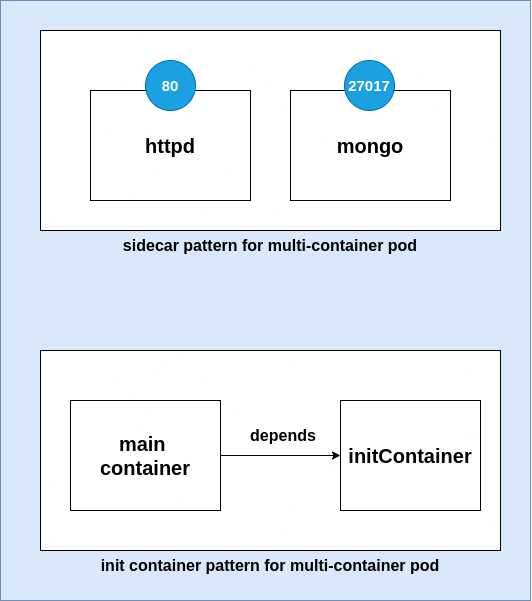  

---
## replica sets

  

- used to create multiple replicas of selected pod

  

```bash
# get list of replica-set
> kubectl get replicasets
> kubectl get replicaset
> kubectl get rs

# get details of selected replica-set
> kubectl describe rs <rs name>


# to scale out or in, update the replicas in yaml file
> kubectl apply -f <rs yaml file>

# delete a replica-set
> kubectl delete replicaset <rs name>
```
### Replicaset Architecture

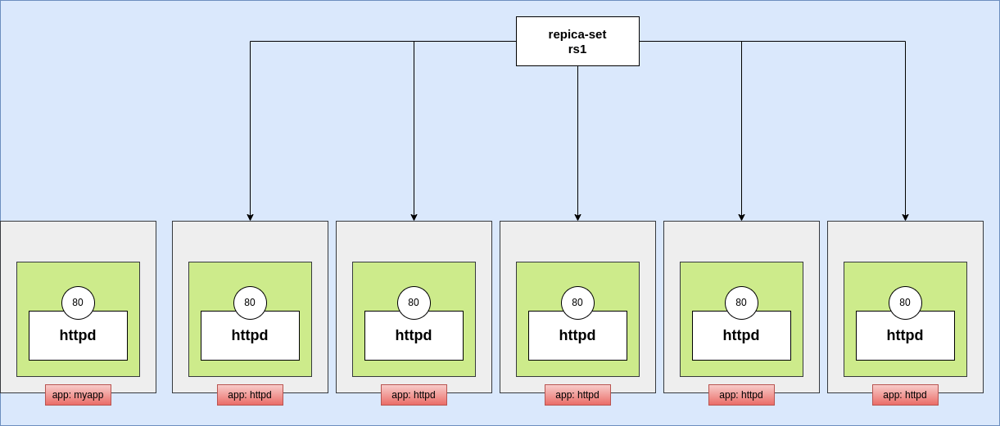  

## service

  

- used to balance the load amongst multiple pods

- these multiple pods can be created using replica-set or deployment

- types

- ClusterIP

- service which will be accessible only within the cluster

- service can not be accessed outside the cluster

- can be used to access an application inside the cluster by other pods

- e.g. frontend pod is accessing backend service which is load balancing the backend pods

- ports

- port

- the internal client will send the request to service on this port

- you are free to choose this port as per your requirement

- targetPort

- service will forward the request to pod(s) on this port

- this port number must be same as the port on which the pod is listening on

- NodePort

- service will make the application accessible outside the cluster

- it internally will create a clusterIP service

- ports

- port

- the internal client will send the request to service on this port

- you are free to choose this port as per your requirement

- targetPort

- service will forward the request to pod(s) on this port

- this port number must be same as the port on which the pod is listening on

- nodePort

- the port assigned to the node on which external client will send the request

- if needed you can specify the nodePort within the range of 30000-32767

- if not specified, the kubernetes will assign a random nodePort to the service

- LoadBalancer

- used to create a load balancer in cloud (for AWS it will create ALB)

  

```bash
# get the list of services
> kubectl get services

# get the service details
> kubectl describe service <service name>
```

### Service architecture

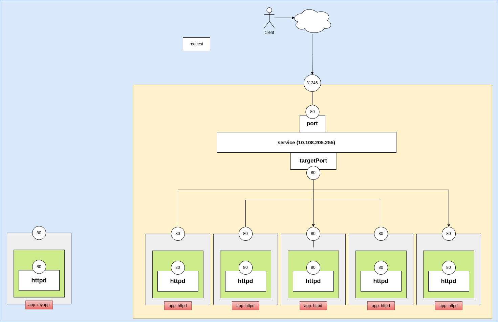

## config map

  

- collection of key-value pairs (configuration)

- used for storing non-sensitive application configurations

- e.g. port number, backend url

- all the configurations stored in config map are exposed to the application

via environment variables

- all values must be in string format (wrapped in double quotes)

```bash
# get the list of config maps
> kubectl get configmap
> kubectl get cm

# get details of selected config map
> kubectl describe cm <cm name>

# delete selected config map
> kubectl delete cm <cm name>
```

  

## secrets

  

- collection of key-value pairs (configuration)

- used for storing sensitive application configurations

- e.g. password, secret, access token

- all the configurations stored in secrets are exposed to the application

via environment variables

- all values must be in bas64 encoded string format (wrapped in double quotes)

  

```bash
# get the list of secrets
> kubectl get secrets
  
# get details of a selected secret
> kubectl describe secret <secret name>

# delete selected secret
> kubectl delete secret <secret name>
```

  

## deployment

  

- represents logical deployment of an application

- internally it uses replica set to replicate the pods

- can be updated or rollbacked using rollout commands

  

```bash

# get the list of deployments
> kubectl get deployments
> kubectl get deploy

# get details of selected deployment
> kubectl describe deploy <deploy name>

# delete deployment
> kubectl delete deploy <deploy name>
```
---
### Deployment architecture

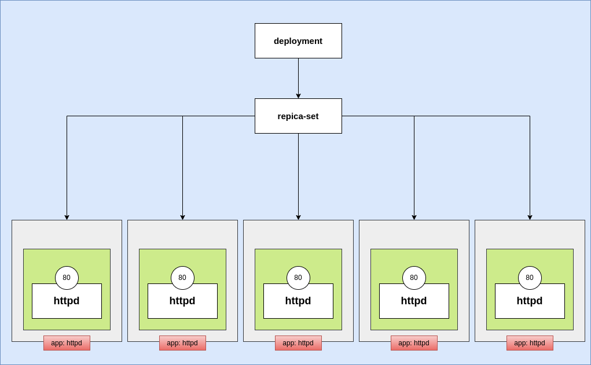  
---

## rollout

  

```bash
# restart the deployment using rollout
# this will force deployment to load the new version from docker hub
> kubectl rollout restart deployment <deployment-name>

# get the history of rollout
> kubectl rollout history deployment <deployment-name>

# rollback to the older version (previous version)
> kubectl rollout undo deployment <deployment-name>

# rollback to the specific older version
> kubectl rollout undo deployment <deployment-name>  --to-revision=<version-number>

# update the image tag (version)
> kubectl set image deployment <deployment-name>  <container-name>=<newer version>

# get the current status of rollout
> kubectl rollout status deployment <deployment-name>
```

  

## persistent volumes

  

```bash
# get the list of persistent volumes
> kubectl get persistentvolumes
> kubectl get pv

# create a pv
> kubectl apply -f pv.yaml

# get details of selected pv
> kubectl describe pv <pv name>

# delete a pv
> kubectl delete pv <pv name>
```

  

## persistent volume claim

  

```bash
# get the list of pvc
> kubectl get pvc

# get details of a selected pvc
> kubectl describe pvc <pvc name>

# delete a pvc
> kubectl delete pvc <pvc name>
```
---
### persistent volume claim architecture 

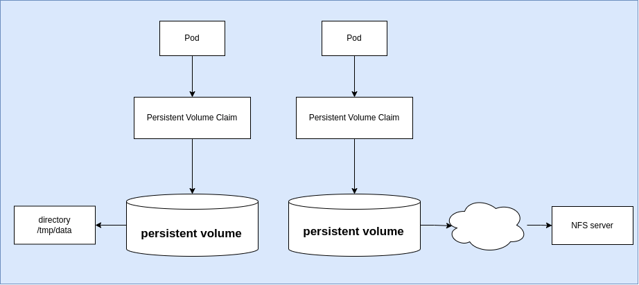  

---

## metrics service

  

```bash
# apply the metrics server yaml
> kubectl apply -f https://github.com/kubernetes-sigs/metrics-server/releases/latest/download/components.yaml

 
# the above url will deploy the metrics server in kube-system namespace
# by default, this will not work
# to fix the problem
> kubectl edit deployment metrics-server -n kube-system

# add the following line on line number 45
>  --kubelet-insecure-tls=true

# save and exit => esc :wq

# get the top node usage
> kubectl top nodes

# get the top pods usage
> kubectl top pods

# get all the resources created in the kube-system namespace
> kubectl get all -n kube-system
```
## horizontal pod autoscaling

```bash
# get the list of hpa
> kubectl get hpa

# get details of selected hpa
> kubectl describe hpa <hpa name>

# delete a selected hpa
> kubectl delete hpa <hpa name>
```
---
### Metrics service and HPA architecture

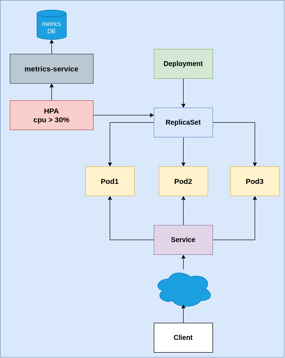  

## job

  

```bash
# get the list of jobs
> kubectl get jobs

# get details of selected job
> kubectl describe job <job name>

# delete a selected job
> kubectl delete job <job name>
```

  

## cron job

  

```bash
# get the list of cronjobs
> kubectl get cronjobs

# get details of selected cronjob
> kubectl describe cronjob <cronjob name>

# delete a selected cronjob
> kubectl delete cronjob <cronjob name>
```

---
<div style="page-break-after: always;"></div>

# Helm

  

- package manager for managing the applications inside K8s

  

## installation
```bash
# download the script file to install the helm
> curl -fsSL -o get_helm.sh https://raw.githubusercontent.com/helm/helm/main/scripts/get-helm-3

# change the permission to execute the file
> chmod 700 get_helm.sh

# run the bash script to install helm
> ./get_helm.sh

# check if helm is installed
> helm version
```

## charts
- chart as a package which contains all the yaml files for running the application in k8s cluster along with its all dependencies

```bash
# get the list of charts created or installed
> helm list

# create a new chart

# > helm create <chart name>
> helm create website

# once the chart get created, simply delete everything from templates directory
# copy your yaml files inside the templates directory

# install the chart
# > helm install <chart name> <chart location>
> helm install website ./website

# uninstall the chart
# > helm uninstall <chart name>
> helm uninstall website
```

  

## helm repositories

```bash
# get the list of installed repos
> helm repo list

# add a repo

# > helm repo add <name> <repo url>
> helm repo add prometheus-community https://prometheus-community.github.io/helm-charts

> helm repo add grafana https://grafana.github.io/helm-charts

# download the charts from repo
> helm repo update

# install prometheus
> helm install prometheus prometheus-community/prometheus

# install grafana
> helm install grafana grafana/grafana
```
---
<div style="page-break-after: always;"></div>

# Jenkins

### Architecture
---
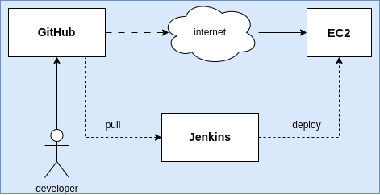


## installation

  

```bash
# update the apt cache
> sudo apt-get update

# install jre
> sudo apt-get install openjdk-17-jdk 

# download the apt key for jenkins repo
> sudo wget -O /usr/share/keyrings/jenkins-keyring.asc \
https://pkg.jenkins.io/debian-stable/jenkins.io-2023.key

# install the key
echo  "deb [signed-by=/usr/share/keyrings/jenkins-keyring.asc]"  \
https://pkg.jenkins.io/debian-stable binary/ | sudo tee \
/etc/apt/sources.list.d/jenkins.list  >  /dev/null


# update the apt cache
> sudo apt-get update

# install jenkins
> sudo apt-get install jenkins

# check the status of jenkins service
> sudo systemctl status jenkins

# enable and start the jenkins service
> sudo systemctl enable --now jenkins
```

  

## configure the jenkins

  

```bash
# visit the url: http://<ip>:8080
# enter the initial password from /var/lib/jenkins/secrets/initialAdminPassword file
> sudo cat /var/lib/jenkins/secrets/initialAdminPassword
```

  

## automating the passwordless authentication with EC2 instance

  

- execute these instructions on your machine


```bash
# login as root

> sudo su

# login as jenkins

> su jenkins

# generate a ssh key

> ssh-keygen

# do not set any passphrase

# this will create a private key named id_ed25519 and public key with name id_ed25519.pub

# copy the contents of id_ed25519.pub and paste them to the EC2's

# - /home/ubuntu/.ssh/authorized_keys file

# test passwordless auth by login to the ec2 instance

> ssh ubuntu@<public ip of ec2>
```

  

## install and configure the ssh plugin

  

```bash
# install the ssh and publish over ssh plugins from manage jenkins screen

# go to the system configuration from manage jenkins

# configure the ssh servers (SSH remote hosts)

# - name: alias for ec2 instance

# - hostname: public ip address of ec2 instance

# - username: ubuntu

# - remote directory: /home/ubuntu

# - key: contents of pem file
```

  

## job configuration

  

```bash
# execute shell commands
> echo $SERVER_IP
# upload the file named index.html to the ec2 instance
> scp index.html ubuntu@$SERVER_IP:~/
```

  

```bash
# execute commands over ssh
> sudo mv ~/index.html /var/www/html
```

  

## configure email notification

  

- settings for Extended E-mail Notification

```bash
# SMTP server: smtp.gmail.com
# SMTP port: 465
# User SSL: true
# create app password
> https://myaccount.google.com/u/1/apppasswords
# remove the space and copy the password
```

  

## using docker

  

```bash
# add jenkins to the docker group
> sudo usermod -aG docker jenkins

# restart the jenkins service
> sudo systemctl restart jenkins

# create Dockerfile
# include docker in the system path
>  export  PATH=$PATH:/usr/bin/

# create image
> docker image build -t <dockerhub username>/python-server .

# login to the docker hub
> echo <docker hub token>  |  docker  login  -u  <docker  hub  username>  --password-stdin


# push the image to docker hub
docker  image  push  <dockerhub  username>/python-server

# remove the service
docker service  rm  python-server

# create the service again
docker  service  create  --name  python-server  --replicas  2  -p  5000:5000  <dockerhub  username>/python-server
```
---
<div style="page-break-after: always;"></div>

# ArgoCD

  

## installation

  

```bash
# create a namespace for argocd
> kubectl create namespace argocd

# install argoCD using yaml file

> kubectl apply -n argocd -f https://raw.githubusercontent.com/argoproj/argo-cd/stable/manifests/install.yaml

# once installed and all components are running in argocd namespace,

# edit the argocd-server service to change the type to NodePort
> kubectl edit service argocd-server -n argocd

# expose the service for argocd (only for minikube)
> minikube service argocd-server -n argocd

# get the initial admin password
> kubectl edit secret argocd-initial-admin-secret -n argocd

# get the password from secret decoded
> echo <base64 encoded password>  |  base64  -d
```

  

## create ArgoCD application

  

```bash
# application name: website-app

# project name: default

# sync policy: automatic

# self heal: checked

# repository url: github repo url

# path: ./ (this is the path where the deployment.yaml file is located)

# k8s cluster: https://kubernetes.default.svc

# namespace: default
```
---
<div style="page-break-after: always;"></div>

# SonarQube

  

## installation

  

```bash
# install unzip
> sudo apt-get install unzip

# download the sonarqube
> wget https://binaries.sonarsource.com/Distribution/sonarqube/sonarqube-9.9.8.100196.zip

# unzip the zip file
> unzip sonarqube-9.9.8.100196.zip

# start the sonarqube server
> cd sonarqube-9.9.8.100196/bin/linux-x86-64
> bash sonar.sh start

# check the sonarqube installation
> visit http://<vm ip address>:9000
```

  

## install sonar-scanner

  

```bash
# download the respective version from
> https://docs.sonarsource.com/sonarqube-server/9.9/analyzing-source-code/scanners/sonarscanner/

# download the file for linux
> wget https://binaries.sonarsource.com/Distribution/sonar-scanner-cli/sonar-scanner-cli-6.2.1.4610-linux-x64.zip

# unzip the file
> unzip sonar-scanner-cli-6.2.1.4610-linux-x64.zip

# rename the directory
> mv sonar-scanner-cli-6.2.1.4610-linux-x64 sonar-scanner

# move the directory to /var/lib/
> sudo mv sonar-scanner /var/lib
```
---
